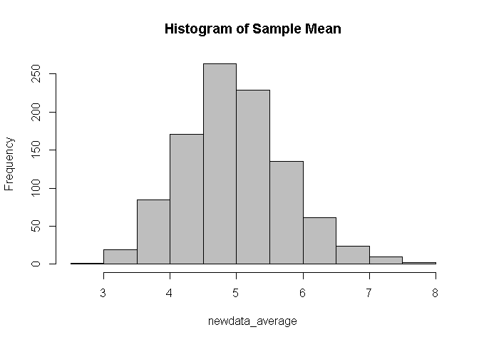
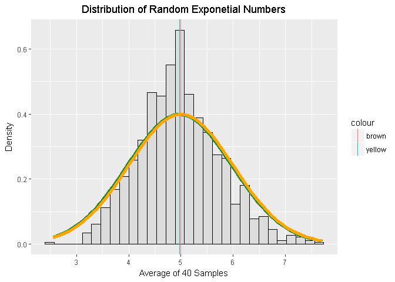

##### Overview:

The xponential distribution can be simulated in R with rexp(n, lambda) where lambda is the rate parameter. The purpose of this data analysis is to investigate the exponential distribution and compare it to the Central Limit Theorem. For this study, lambda will be set = 0.2 for all simulations. The mean of exponential distribution is 1/lambda and the standard deviation is also 1/lambda. We will investigate the distribution of averages of 40 exponentials by doing over thousand simulations.

#### Simulations:

``` r
set.seed(394651)
lambda <- 0.2 
#n is the number of exponentials
n <- 40 
number_Of_simulations <- 1000 
```

Create a matrix with 1000 simulations(1000 rows) each with 40(columns) samples drawn from the exponential distribution.

``` r
newdata <- matrix(rexp(n * number_Of_simulations, rate = lambda), number_Of_simulations)
```

Calculating the mean

``` r
newdata_average <- rowMeans(newdata)
```

#### Sample Mean versus Theoretical Mean:

Show the sample mean and compare it to the theoretical mean of the distribution.

``` r
SampleMean <- mean(newdata_average)
hist(newdata_average,col="gray", main="Histogram of Sample Mean",adj = 0.5)
```



``` r
paste('Sample mean is', round(SampleMean,3))
```

    ## [1] "Sample mean is 4.97"

``` r
TheoreticalMean <- 1/lambda
paste('The Theoretical Mean is', round(TheoreticalMean,3))
```

    ## [1] "The Theoretical Mean is 5"

#### Based on the values of the Sample Mean and Theoretical Mean, we can say that both means are very close.

#### Sample Variance versus Theoretical Variance:

``` r
SampleVariance <- var(newdata_average)
TheoreticalVariance <- (1 / lambda)^2 / (n) 
```

    ## [1] "The Sample Variance is 0.61"

    ## [1] "The Theoretical Variance is 0.625"

#### Based on the values of the above, we can say that the Sample Variance and the Theoretical Variance are very close.

#### Distribution

``` r
library(ggplot2)
newdata_average_df <- data.frame(newdata_average)
ggplot(newdata_average_df, aes(x =newdata_average)) + 
  geom_histogram(aes(y=..density..), colour="black",fill="gainsboro") +
  labs(title = "Distribution of Random Exponetial Numbers", x = "Average of 40 Samples", y = "Density") +
  theme(plot.title = element_text(hjust = 0.5))+
  geom_vline(aes(xintercept = SampleMean, colour = "yellow")) +
  geom_vline(aes(xintercept = TheoreticalMean, colour = "brown"))+
  stat_function(fun = dnorm, args = list(mean = SampleMean), colour = "forestgreen", size = 2.0)+
  stat_function(fun = dnorm, args = list(mean = TheoreticalMean), colour = "orange", size = 2.0)
```

    ## `stat_bin()` using `bins = 30`. Pick better value with `binwidth`.



#### Conclusion

1.  From the plot above, we observe both distributions almost overlap each other.
2.  The distribution of sample means follows a normal distribution
3.  also see that the curve resemles a bell curve or normal distribution.

**Hence based on the findings above we can state that the distribution does indeed demonstrate Central Limit Theorem.**
